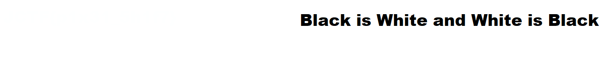
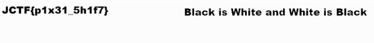

# Writeup 2

## Challenge Name - B&W

> ### About Challenge

Next challenge was about finding a flag in image shown below 

> ### Solution
I initially used Steg, Hex check for this file, but all went in vain. Then I used https://29a.ch/photo-forensics/ to analyze the image. Upload the image. Select Principal Component Analysis and set Component Value to Max. You will get the Flag hidden in image.

> Flag is `JCTF{p1x31_5h1f7}`