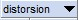
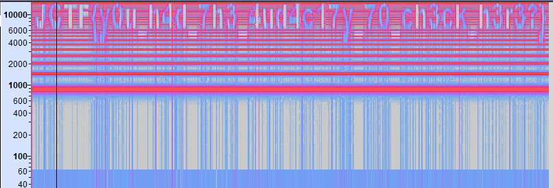

# Writeup 5

## Challenge Name - Distorted Audio

> ### About Challenge
Again here a [.wav](distorsion.wav) file is provided.

> ### Solution
* On playing this audio you will recieve weird sound 😫.
* For this use [Audacity Software](https://www.audacityteam.org/download/).
* Open file in Audacity.
* Choose Spectogram form 
* Select Spectogram Setting from  
  * Choose Scale Type as Logarithmic
  * set Max Frequency to 150000 Hz.
and the flag is there 😂.

> Flag is `JCTF{y0u_h4d_7h3_4ud4c17y_70_ch3ck_h3r3?}`