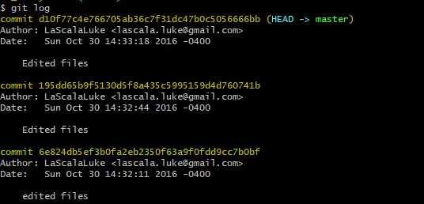

# Writeup 8

## Challenge Name - Great Indian Turtle

> ### About Challenge
This challenge is all about Git. We are given a [ZIP](git_is_everywhere.zip).
> ### Solution
* For this chall u will need `GitBash`.
* Extract ZIP. Open folder with `GitBash`.
* Use command `git log`
  
* Use command `git revert d10f77c4e766705ab36c7f31dc47b0c5056666bb`
* this will revert the changes made by person in that commit. And changes will be reflected in flag.txt
* Open flag.txt and you get flag there.
  
> Flag is `JCTF{protect_your_git}`