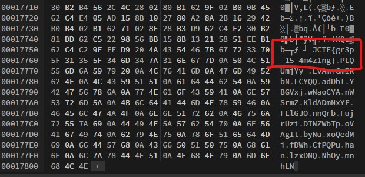

# Writeup 9

## Challenge Name - Hidden

> ### About Challenge
Given an [Image](cat.jpg)

> ### Solution
* Method 1 - 
  * use command `strings cat.jpg` u will get the flag.
* Method 2 
  * Open image in Hexed.it and reach bottom.
    

> Flag is `JCTF{gr3p_15_4m4z1ng}`